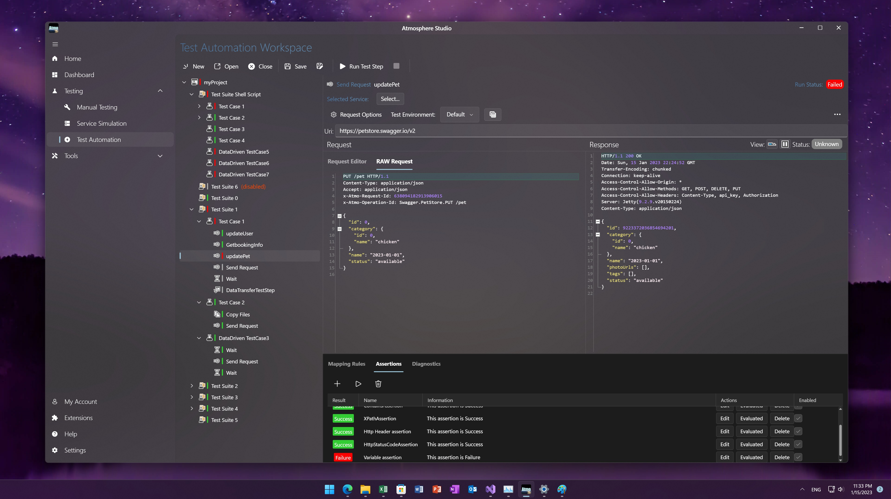

# Atmosphere Studio
Atmosphere Studio is a Cross-platform and All-in-One API Testing and Automation solution, running on Windows, MacOS and Linux.

This repository is aimed to open-source the documentation of Atmosphere Studio product

## Documentation website
The documentation website is deploed at: https://stellar-qa.com/docs

Once the changes is made on `main` branch it will be deploied later.

### Folders
- `docs`: documentation of the software, by funcitonality
- `training`: step-by-step learning courses for API Testing using Atmosphere Studio
- `faqs`: frequentely asked questions. it can be alimented by community support.
